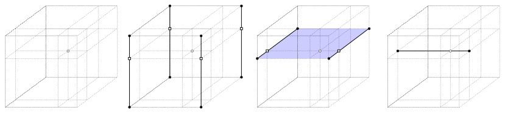

# Ndpolator

Fast, n-dimensional linear interpolation and extrapolation on sparse grids.

Ndpolator is a combined interpolator/extrapolator that operates on sparse (incompletely populated) $n$-dimensional grids. It estimates scalar or vector function values within and beyond the definition range of the grid while still avoiding the need to impute missing data or sacrifice the benefits of structured grids. Ndpolator is written in C for speed and portability; a python wrapper that uses numpy arrays is provided for convenience.

# Recent changes

## ndpolator 1.2.1

* the computation of distance between the query point and the grid was not done correctly in off-grid vertices; fixed.

* the find_nearest() function now stores an array of nearest points sorted by distance.

## ndpolator 1.2

* distance between the query point and the grid for off-grid query points is now explicitly computed and returned.

* github workflows substantially improved.

## ndpolator 1.1

* memory management improvements.

## ndpolator 1.0

* initial release.

# Installation

Ndpolator sources are hosted on pypi; you can install the latest release by issuing:

```bash
pip install ndpolator
```

To install ndpolator from github, clone the repo and install it from the local directory with pip:

```bash
$> git clone https://github.com/aprsa/ndpolator ndpolator
$> cd ndpolator
$> pip install .
```

Once installed, you can test the installation by running a pytest:

```bash
$> cd tests
$> pytest
```

# Documentation

API reference is available on [gh-pages](https://aprsa.github.io/ndpolator).

# Usage example

To demonstrate the usage of ndpolator, let us consider a 3-dimensional space with three axes of vastly different vertex magnitudes. For comparison purposes, let the function that we want to interpolate and extrapolate be a linear scalar field:

```math
\mathbf a_1 = \{1000, 2000, 3000, 4000, 5000\}, \quad \mathbf a_2 = \{1, 2, 3, 4, 5\}, \quad \mathbf a_3 = \{0.01, 0.02, 0.03, 0.04, 0.05\},
```

```math
\mathbf F(x, y, z) = \frac{x}{1000} + y + 100 z.
```

A suitable ndpolator instance would be initiated and operated as follows:

```python
import numpy
import ndpolator

# initialize the axes:
a1 = np.linspace(1000, 5000, 5)
a2 = np.linspace(1, 5, 5)
a3 = np.linspace(0.01, 0.05, 5)

# initialize interpolation space:
ndp = ndpolator.Ndpolator(basic_axes=(a1, a2, a3))

# define a scalar function field and evaluate it across the grid:
def fv(pt):
    return pt[0]/1000 + pt[1] + 100*pt[2]

grid = np.empty((len(ax1), len(ax2), len(ax3), 1))
for i, x in enumerate(ax1):
        for j, y in enumerate(ax2):
            for k, z in enumerate(ax3):
                grid[i, j, k, 0] = fv((x, y, z))

# label the grid ('main') and register it with the ndpolator instance:
ndp.register(table='main', associated_axes=None, grid=grid)

# draw query points randomly within and beyond the definition ranges:
query_pts = np.ascontiguousarray(
    np.vstack((
        np.random.uniform(500, 5500, 1000),
        np.random.uniform(0.5, 5.5, 1000),
        np.random.uniform(0.005, 0.055, 1000))
    ).T
)

# interpolate and extrapolate linearly:
interps = ndp.ndpolate(table='main', query_pts, extrapolation_method='nearest')
```

# Purpose

Multi-variate ($n$-dimensional) interpolation and extrapolation are techniques used in mathematics, statistics and science to estimate unknown values between and beyond existing data points in a multi-dimensional space. *Interpolation* involves estimating the function value at points *within* the range determined by the existing data points, while *extrapolation* involves estimating the function value *beyond* that range. There are numerous robust implementations of multi-variate interpolation, including k nearest neighbors [(Cover & Hart 1967)](https://ieeexplore.ieee.org/document/1053964), natural neighbor interpolation [(Sibson 1981)](https://api.semanticscholar.org/CorpusID:115462887), radial basis functions [(Hardy 1971)](https://agupubs.onlinelibrary.wiley.com/doi/abs/10.1029/JB076i008p01905), kriging [(Cressie 1990)](https://link.springer.com/article/10.1007/BF00889887), and many others. Scipy, for example, features an entire module for interpolation (`scipy.interpolate`) that implements several multi-variate interpolation classes, including piecewise-linear, nearest neighbor, and radial basis function interpolators. Unfortunately, none of the implemented scipy methods lend themselves readily to extrapolation: at most they can fill the values off the convex hull with `nan`s or a value supplied by the user. In addition, interpolators that operate on a regular $n$-dimensional grid do not allow any missing data; those values either need to be imputed by using unstructured data interpolators, or structured data interpolators need to be abandoned altogether.

Ndpolator aims to fill this gap: it can both interpolate and extrapolate function values within and beyond the grid definition range, and it can operate on incomplete grids. As a side benefit, ndpolator can estimate both scalar and vector function values, and it can reduce grid dimensionality for points of interest that lie on grid axes. It is optimized for speed and portability (the backend is written in C), and it also features a python wrapper. Ndpolator was initially developed for the purposes of the eclipsing binary star modeling code PHOEBE [(Prša et al. 2016)](https://ui.adsabs.harvard.edu/abs/2016ApJS..227...29P), to allow the interpolation and extrapolation of specific intensities in stellar atmospheres. Yet given the gap in the multi-variate interpolation and extrapolation landscape, ndpolator development has been separated from PHOEBE and made available to the community as a standalone package.

# Ndpolator's operation principles

Consider a scalar or a vector field $`\mathbf{F}`$ that is sampled in a set of $`N`$ $`n`$-dimensional points, $`\{\mathbf F (x_1, \dots, x_n)_k\}`$, $`k = 1 \dots N`$. Let these function values be sampled on a grid, where axes $`\mathbf{a}_k`$ span each grid dimension, so that $`\mathsf{X}_{k=1}^{n} \mathbf a_k \equiv \mathbf{a}_1 \times \mathbf{a}_2 \times \dots \times \mathbf{a}_n`$ is a cartesian product that spans the grid. Axis spacing need not be uniform: vertices can be separated by any amount that is required to make the grid sufficiently locally linear. If the grid is *complete*, i.e. if there is a function value $`\mathbf F(x_1, \dots, x_n)`$ associated with each grid point, we have $`N_c = \prod_k l(\mathbf a_k)`$ function value samples, where $`l(\mathbf a)`$ is the length of axis $`\mathbf a`$. If the grid is *incomplete*, i.e. if some function values are missing, then $`N < N_c`$. Ndpolator defines grid points with sampled values as *nodes*, and grid points with missing values as *voids*. The points in which we want to estimate the function value are called *query points* or *points of interest*. The smallest $`n`$-dimensional subgrid that encloses (or is adjacent to) the query point is called a *hypercube*.

## Unit hypercube transformation

The first, most fundamental principle of ndpolator is that all interpolation and extrapolation is done on **unit hypercubes**. In real-world applications, it is seldomly true that all axes are defined on a unit interval. This can lead to vertices of significantly different orders of magnitude along individual axes. To that end, ndpolator first normalizes the hypercubes by transforming them to unit hypercubes: given the sets of two consecutive axis values that span a hypercube, $`(\mathbf a_{1,p}, \mathbf a_{1,p+1}) \times (\mathbf a_{2,q}, \mathbf a_{2,q+1}) \times \dots \times (\mathbf a_{n,t}, \mathbf a_{n,t+1})`$, the unit transformation maps it to the $`[0, 1] \times [0, 1] \times \dots \times [0, 1] \equiv [0, 1]^n`$ hypercube. All query points are subjected to the same transformation, creating *unit-normalized* query points. Therefore, interpolation (and extrapolation) **always** operates on unit hypercubes, which is computationally the least expensive and numerically the most stable process. An additional benefit of this transformation is that extrapolation inherits the nearest hypercube's grid spacing, thus naturally accounting for (potentially) variable spacing in different regions of the grid.

## Sequential dimensionality reduction

The second operating principle of ndpolator is **sequential dimensionality reduction**. Consider a 3-dimensional hypercube in \autoref{fig:interpolation}; let us assume that function values in all 8 corners of the hypercube are sampled, i.e. we have 8 nodes. The point of interest is depicted with an open symbol in the left panel, along with projections onto the hypercube faces. Ndpolator starts with the last axis, in this case $`\mathbf a_3`$, and it interpolates function values along that axis to the projections of the point of interest (second panel). These are *univariate* interpolations. The process yields 4 vertices (depicted in open symbols), thereby reducing the initial dimension $`N=3`$ by 1, to $`N-1=2`$. The process is then repeated (third panel), this time along the second axis, $\mathbf a_2$, yielding 2 vertices, thereby reducing the dimension to 1. Finally, the last interpolation is done along axis $`\mathbf a_1`$ (right panel), yielding a single vertex, the point of interest itself. The dimension is thus reduced to 0, and the function value is determined. Thus, for an $`n`$-dimensional hypercube, ndpolator performs $`\sum_{k=0}^{n-1} 2^k`$ univariate interpolations to estimate $`\mathbf F`$ in the point of interest, which implies the $`N \log N`$ time dependence.



## Initial dimensionality reduction

The third operating principle of ndpolator is **initial dimensionality reduction**. In real-life applications it frequently happens that some of query point coordinates are aligned with the axes. For example, one of the axes might allow the variation of the second order variable, but its value usually defaults to the value that is sampled across the grid. When this happens, the initial hypercube dimension can be reduced by 1 for each aligned axis. The extreme case where the query point coincides with a node means that hypercube dimensionality is reduced to 0, and there is no need for interpolation. For that reason, ndpolator flags each coordinate of the query point as "on-grid", "on-vertex", or "out-of-bounds". When "on-vertex," hypercube dimension can be immediately reduced. When that happens, the time dependence is reduced to $`(N-M) \log (N-M)`$, where $`M`$ is the number of coordinates aligned with the axes.

## Incomplete hypercubes

The fourth operating principle of ndpolator is dealing with **incomplete hypercubes**. If any of the hypercube corners are voids, we cannot interpolate. For that purpose, ndpolator keeps track of all fully defined $n$-dimensional hypercubes; when a query point lies within an incomplete hypercube, ndpolator finds the nearest fully defined hypercube and uses it to extrapolate the function value in the point of interest. While this is globally still considered interpolation as the query point is within the grid's definition range, the estimated function value is, strictly speaking, *extrapolated* from the nearest fully defined hypercube. Note that, when grids are particularly sparse and functios strongly non-linear, that can cause a substantial accumulation of error. In such cases, unstructured interpolation techniques might be a better fit.

## Extrapolation modes

The fifth operating principle of ndpolator is **extrapolation**. Ndpolator has three extrapolation methods: `none`, `nearest` and `linear`. When extrapolation method is set to `none`, the function value that is outside the range of axes is set to `nan`. For extrapolation method `nearest`, ndpolator stores a list of all nodes and assigns a function value in the node that is nearest to the query point. Lastly, if extrapolation method is set to `linear`, ndpolator linearly extrapolates from the nearest fully defined hypercube in a manner equivalent to dealing with incomplete hypercubes. The choice for extrapolation method depends on the multi-variate function that we are estimating; if it is highly non-linear, extrapolation should be avoided, so `none` and `nearest` might be appropriate; if it is largely linear or varies slowly, then a `linear` extrapolation method might be warranted. Ndpolator is a *linear* extrapolator, so it cannot adequately estimate non-linear multi-variate functions.

## Basic axes and associated axes

The question of grid completeness is quite impactful for performance; that is why the sixth operating principle of ndpolator is to distinguish between **basic axes** and **associated axes**. Axes that can have voids in their cartesian products are referred to as *basic*. For these axes, we need full ndpolator machinery to perform interpolation and extrapolation. On the other hand, a subset of axes may have all nodes in their cartesian products, i.e. they are guaranteed to be sampled in all vertices that basic axes are sampled in; these are referred to as *associated* axes. Given that their sampling is ascertained, interpolation and extrapolation can proceed without concerns for incomplete hypercubes -- that is, for as long as their basic hypercube counterparts (hypercubes spun by basic axes) are complete. Each associated axis reduces the dimensionality of the hypercubes that need to be stored for extrapolation lookup, thus optimizing performance further.

## Function value dimensionality

The seventh and final operating principle concerns **function value dimensionality**. Most interpolators assume that the function value $`\mathbf F`$ is a scalar; ndpolator does not make that assumption. $`\mathbf F_r(x_1, \dots, x_n)`$ can be a scalar or a vector or arbitrary length $`R`$ (within reason, of course). It is then a requirement that all nodes are also $`R`$-dimensional. Ndpolator will then interpolate and extrapolate all function value components separately, and yield an $`R`$-dimensional estimate of the function value $`\mathbf F`$ in the point of interest.

## Hypercube caching

While not explicitly a part of ndpolator's operating principles, ndpolator exposes two auxiliary functions, `import_query_pts()` and `find_hypercubes()`, that can be used to cache hypercubes. That way, a calling program can group query points that are enclosed by a single hypercube and perform bulk interpolation without the need to find the corresponding hypercube for each query point successively. While the indexing and the hypercube search are both binary, avoiding the lookup when possible further optimizes the runtime.

# API documentation and tests

Ndpolator is released under the GNU General Public License. The Application Programming Interface (API) is available for the underlying C library on [gh-pages](https://aprsa.github.io/ndpolator). The test suite and automated API building are incorporated into github's Continuous Integration (CI) infrastructure. Any and all feedback, particularly issue reporting and pull requests, are most welcome.

# Acknowledgements

Financial support for this project by the National Science Foundation, grant [\#2306996](https://www.nsf.gov/awardsearch/showAward?AWD_ID=2306996&HistoricalAwards=false), is gratefully acknowledged.
